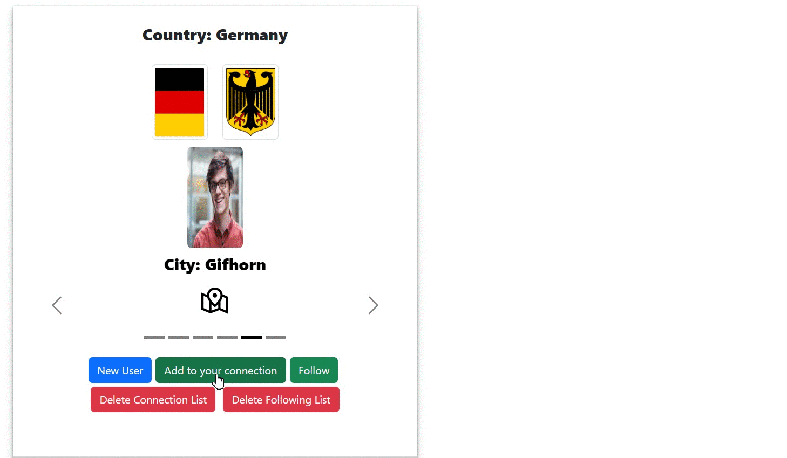

# Friend Tracker Application

## Description

Project aims to create a Friend Tracker Application.

## Project Skeleton

```
Friend Tracker Application (folder)
|
|----readme.md        
├── public
│     └── index.html
├── src
│    ├── addConnection
|    |     └── AddConnection.jsx
│    ├── addFollower
|    |     └── AddFollower.jsx
│    ├── assets
|    |     └── assets.jsx
│    ├── countries
|    |     └── countries.jsx
│    ├── pages
│    │     └── Pages.jsx
│    ├── App.js
│    ├── App.css
│    ├── index.js
│    └── index.css
├── package.json
└── yarn.lock
```


## Objective

Build aFriend Tracker Application using ReactJS.

### At the end of the project, following topics are to be covered;

- HTML

- CSS

- JS

- ReactJS


### At the end of the project;

- Improve coding skills within HTML & CSS & JS & ReactJS. useNavigate, useEffect, useState, useLocation, useNavigate hooks are used in the project.

- Use git commands (push, pull, commit, add etc.) and Github as Version Control System.

🔗 <b>To see live version<b> 🎯https://tal58.github.io/friend_tracker_app/


**<p align="center">&#9786; Happy Coding &#9997;</p>**

<br><br>
🌐 The desktop and mobile versions of the web page are as follows;🧭
<br><br>

## 🖥️Desktop version
<br>

<br>
<br>
<br>
<br>
<br>
<br>
<br>
<br>
<br>
<br><br><br><br><br><br><br><br><br>


## 📱Mobile version
<br>

<br>
<br>
<br>
<br>
<br>
<br>
<br>
<br>
<br>
<br><br><br><br><br><br><br><br><br>


